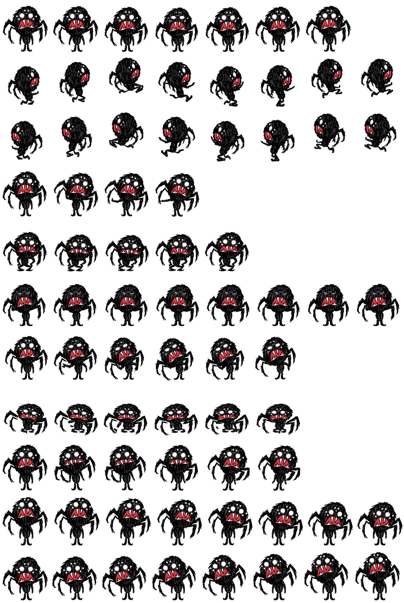

# 韦伯 Codex 桌宠（官方帧版）

用《饥荒》官方贴图和动画一帧一帧抠出来渲染的韦伯桌宠，没有用 AI 画图。

## 安装（一步）

```powershell
powershell -ExecutionPolicy Bypass -File .\install.ps1 -Pet webber
```

它会把 `final\spritesheet-extended.webp` 与 `pet\pet.json` 复制到
`%USERPROFILE%\.codex\pets\webber\`，之后在 Codex 的桌宠列表里选「韦伯」即可。

## 清单字段

```json
{
  "id": "webber",
  "displayName": "韦伯",
  "description": "韦伯，蜘蛛男孩 —— \"我们可以克服万难！\"",
  "spriteVersionNumber": 2,
  "spritesheetPath": "spritesheet.webp"
}
```

名称、称号与台词均取自《饥荒》游戏自带官方中文语言文件
`data/scripts/languages/chinese_s.po`：

- `CHARACTER_NAMES.webber` = 韦伯
- `CHARACTER_TITLES.webber` = 蜘蛛男孩（英文 "The Indigestible"）
- `CHARACTER_QUOTES.webber` = "我们可以克服万难！"

## 成品



| 文件 | 说明 |
| --- | --- |
| `pets/webber/final/spritesheet-extended.webp` | 最终图集，1536×2288，8×11 格，`spriteVersionNumber: 2` |
| `pets/webber/final/spritesheet-extended.png` | 同一图集的 PNG 版本 |
| `pets/webber/final/validation-extended.json` | 官方校验脚本结果：`ok: true`，无 error / 无 warning |
| `pets/webber/final/provenance.json` | 逐行来源记录（哪个官方动画、第几帧、朝向、缩放） |
| `scripts/webber/` | 解码、渲染与 QA 脚本（可复现整套素材） |

## 每一行用的是哪个官方动作

| 行 | 用途 | 官方来源 | 帧 |
| --- | --- | --- | --- |
| 0 | 待机 | 单机版 `player_idles.zip` → `idle_loop`（正面 facing 8） | 0,11,22,32,43,54 |
| 1 | 拖动向右 | 单机版 `player_basic.zip` → `run_loop`（侧视 facing 5，未镜像＝面朝右） | 0,2,4,6,8,9,11,13 |
| 2 | 拖动向左 | 同上，水平镜像 | 0,2,4,6,8,9,11,13 |
| 3 | 打招呼 | DST `player_emotes.zip` → `emote_waving`（经单机版表情移植包 workshop-2649864463 引入） | 0,14,29,44 |
| 4 | 悬停（客户端把它叫 jumping） | 单机版 `player_idles.zip` → `idle_hot_loop`（夏天擦汗，平静不跳） | 7,10,13,28,31 |
| 5 | 出错（精神崩溃） | 单机版 `player_idles.zip` → `idle_sanity_loop` | 0,3,6,9,12,14,17,20 |
| 6 | 等待 | 单机版 `player_idles.zip` → `idle_inaction` | 0,8,16,24,32,40 |
| 7 | 干活（制作物品） | 单机版 `player_actions_item.zip` → `build_loop` | 0,2,5,8,10,12 |
| 8 | 查看成果 | 单机版 `player_actions.zip` → `dial_loop` | 0,8,17,26,34,42 |
| 9-10 | 16 个注视方向 | 官方待机正面帧 + 官方头部整体小幅旋转、脸部（含眼睛）沿方向位移 | 每格一个方向 |

行内缩放统一在 0.40-0.60。

## 与客户端的对应关系（从 Codex 客户端代码里核对过，与威尔逊一致）

- 拖动：指针右移 → 播第 1 行；左移 → 第 2 行。第 1 行必须面朝屏幕右。
- 悬停：`pointerenter` 会把状态强制成 `jumping`（第 4 行）。
- 注视方向：只有在 `idle` / `running` / `waving` 三种状态下客户端才应用第 9/10 行的方向帧。
- 默认外观：与威尔逊相同，渲染时按装备层过滤（持物手臂、帽子头型等游戏默认隐藏的图层）。

## 质量要点

- 客观朝向检查：第 1 行红嘴质心在头部暗色质心右侧（131.3 vs 95.3，面朝右）；第 2 行相反（59.7 vs 95.7，面朝左）；两行像素互为精确镜像（最大差 0）。
- `validate_atlas.py --require-v2`：`ok: true`，1536×2288，8×11，无 error、无 warning。
- 注视方向：白眼特征位移测量 15/16 通过；唯一"失败"是 90°(右) 的 SSD 歧义（左右白眼圈对称），放大目检确认明确朝右，已按威尔逊流程记录到盲测决议（作者本地 `qa/blind-review-resolution.json`）。
- 连续性指标为复核级警告：透明内孔来自蜘蛛腿之间的正常留白；相邻格中心漂移 ≤5px、面积比 ≤1.015，循环无跳变。

## 免责声明

本仓库只打包了渲染流程和最终图集，不包含《饥荒》原版游戏与它的版权资源。若要复现，需自备一份正版《饥荒》，
并使用 `scripts/webber/` 中的脚本从自己的游戏安装目录提取。

## 复现方式

`scripts/webber/` 里是完整流水线：

- `extract_weber.py`：解码韦伯官方 KTEX 贴图集并切分部件
- `render_weber_candidates.py`：批量渲染候选动作接触表
- `assemble_weber.py`：装配 8×11 图集并写入 `provenance.json`
- `qa_weber.py`：客观朝向 / 镜像 / 注视方向测量

运行环境：Python 3.x + Pillow + numpy。`scripts/` 根目录没有共享解码器，`scripts/wilson/` 与
`scripts/webber/` 各自内含一套（ktex.py / kanim.py / render_anim.py），彼此独立可复现。
