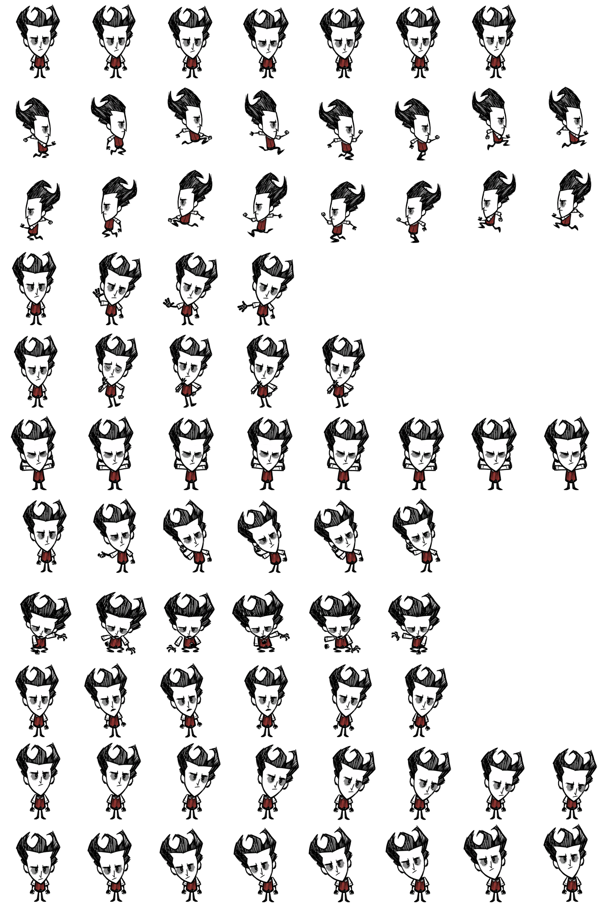

# 威尔逊 Codex 桌宠（官方帧版）

用《饥荒》官方贴图与官方动画数据逐帧渲染出来的威尔逊 Codex v2 桌宠（无 AI 生成图像）。

## 安装（一步）

```powershell
powershell -ExecutionPolicy Bypass -File .\install.ps1 -Pet wilson
```

它会把 `final\spritesheet-extended.webp` 与 `pet\pet.json` 复制到
`%USERPROFILE%\.codex\pets\wilson\`，之后在 Codex 的桌宠列表里选「威尔逊」即可。
（在仓库根目录运行；也可用 `.\install.ps1` 默认值。）

## 清单字段

```json
{
  "id": "wilson",
  "displayName": "威尔逊",
  "description": "威尔逊.P.希格斯伯里，绅士科学家 —— \"我会用我的头脑征服一切！\"",
  "spriteVersionNumber": 2,
  "spritesheetPath": "spritesheet.webp"
}
```

名称、称号与台词均取自《饥荒》游戏自带官方中文语言文件
`data/scripts/languages/chinese_s.po`：

- `CHARACTER_NAMES.wilson` = 威尔逊.P.希格斯伯里（短名 `Wilson` = 威尔逊）
- `CHARACTER_TITLES.wilson` = 绅士科学家
- `CHARACTER_QUOTES.wilson` = "我会用我的头脑征服一切！"

## 成品



| 文件 | 说明 |
| --- | --- |
| `pets/wilson/final/spritesheet-extended.webp` | 最终图集，1536×2288，8×11 格，`spriteVersionNumber: 2` |
| `pets/wilson/final/spritesheet-extended.png` | 同一图集的 PNG 版本 |
| `pets/wilson/final/validation-extended.json` | 官方校验脚本结果：`ok: true`，无 error / 无 warning |
| `pets/wilson/final/provenance.json` | 逐行来源记录（哪个官方动画、第几帧、朝向、缩放） |
| `scripts/wilson/` | 解码与渲染脚本（可复现整套素材） |

## 每一行用的是哪个官方动作

| 行 | 用途 | 官方来源 | 帧 |
| --- | --- | --- | --- |
| 0 | 待机 | 单机版 `player_idles.zip` → `idle_loop` | 0,11,22,32,43,54 |
| 1 | 拖动向右 | 单机版 `player_basic.zip` → `run_loop`（侧视，未镜像＝面朝右） | 0,2,4,6,8,9,11,13 |
| 2 | 拖动向左 | 同上，水平镜像（面朝左） | 0,2,4,6,8,9,11,13 |
| 3 | 打招呼 | 联机版 `player_emotes.zip` → `emote_waving` | 0,14,29,44 |
| 4 | 悬停（客户端把它叫 jumping） | 联机版 `player_idles_wilson.zip` → `idle_wilson`（威尔逊专属待机，平静不跳） | 0,15,30,45,60 |
| 5 | 出错（精神崩溃） | 单机版 `player_idles.zip` → `idle_sanity_loop` | 0,3,6,9,12,14,17,20 |
| 6 | 等待 | 单机版 `player_idles.zip` → `idle_inaction` | 0,8,16,24,32,40 |
| 7 | 干活（制作物品） | 单机版 `player_actions_item.zip` → `build_loop` | 0,2,5,8,10,12 |
| 8 | 查看成果 | 单机版 `player_actions.zip` → `dial_loop` | 0,8,17,26,34,42 |
| 9-10 | 16 个注视方向 | 官方待机正面帧 + 官方头部整体小幅旋转、脸部（含眼睛）沿方向位移 | 每格一个方向 |

行内缩放统一在 0.43–0.53，16 个注视方向与第 0 行第 6 格的正面中性帧共用同一套缩放与基线。

## 与客户端的对应关系（从 Codex 客户端代码里核对过）

- 拖动：指针右移 → 播第 1 行 `running-right`；左移 → 第 2 行 `running-left`。所以第 1 行必须面朝屏幕右。
- 悬停：`pointerenter` 会把状态强制成 `jumping`（**第 4 行**），这个覆盖会盖掉"代理工作中"的状态——盯着桌宠看它干活时看到的是第 4 行，而不是第 7 行。现在第 4 行放的是威尔逊专属待机（平静），第 7 行才是官方制作动作；想在工作中看到制作动画，把鼠标移开桌宠即可。
- 注视方向：只有在 `idle` / `running` / `waving` 这三种状态下客户端才会应用第 9/10 行的方向帧。
- 默认外观：官方动画自带 `ARM_carry`（持物手臂）与带帽头型图层，游戏里默认隐藏；渲染时已按 `HIDDEN_LAYERS` 过滤，否则会出现"三只手"。

## 质量要点

- 朝向客观检查：第 1 行面部重心在头发重心右侧（面朝右），第 2 行相反（面朝左），且两行像素互为精确镜像（最大差 0）。
- 悬停行平静度：第 4 行逐帧竖直位移 1.2px、上下边界 0px（第 0 行待机为 3.9px），确认不再有跳跃幅度。
- 手臂数量：过滤规则生效后每帧只绘制 2 个 hand 元素。
- `validate_atlas.py --require-v2`：`ok: true`，1536×2288，8×11，无 error、无 warning（安装后的文件也复验过一次）。
- 注视方向：客观测量眼部特征位移，四个 cardinal 的角度误差分别约 7° / 0° / 0° / 0°，12 个中间方向全部落在正确象限、无回环反转。

## 免责声明

本仓库只打包了渲染流程和最终图集，不包含《饥荒》原版游戏与它的版权资源。若要复现，需自备一份正版《饥荒》，
并使用 `scripts/` 中的脚本从自己的游戏安装目录提取。

## 复现方式

`scripts/` 里是完整流水线：

- `ktex.py`：KTEX 贴图解码（格式依据开源工具 `ktech`），配 `extract_wilson.py` 提取官方图集与部件
- `kanim.py`：`BILD v6` / `ANIM v4` 解码（格式依据开源工具 `krane`）
- `render_anim.py`：按官方元素顺序与变换矩阵逐帧渲染
- `render_candidates.py`：批量渲染候选动作接触表
- `assemble_pet.py`：装配 8×11 图集并写入 `provenance.json`

运行环境：Python 3.x + Pillow + numpy。
